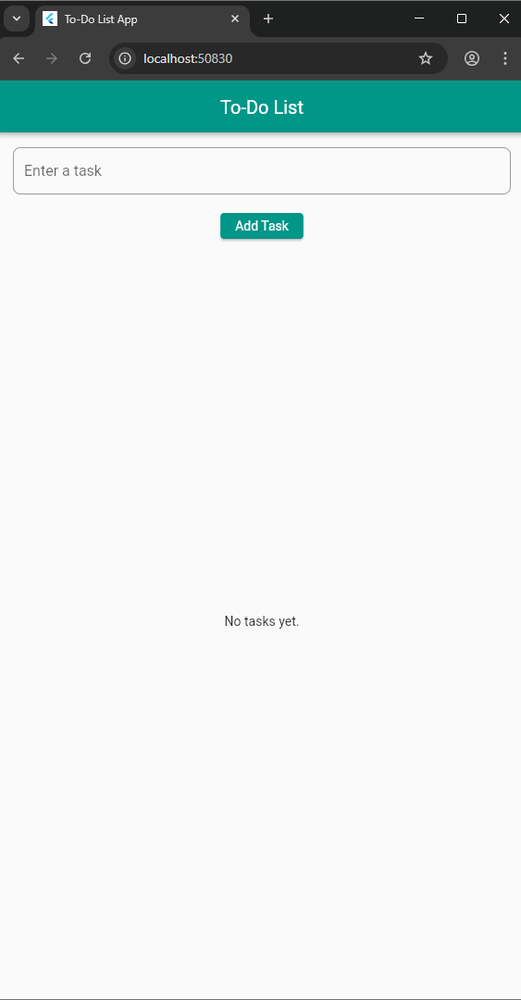
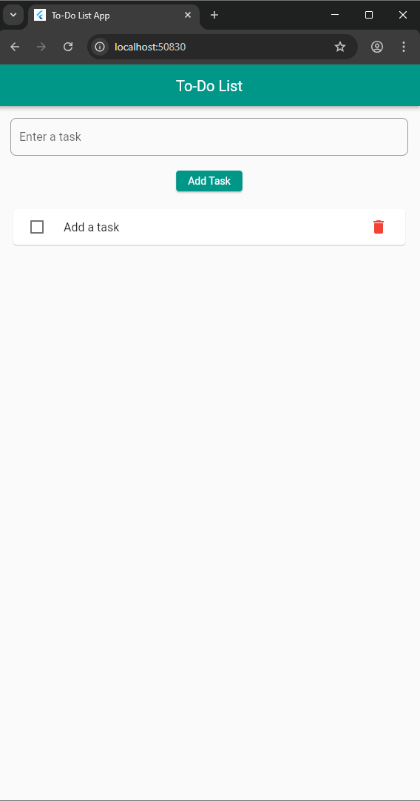
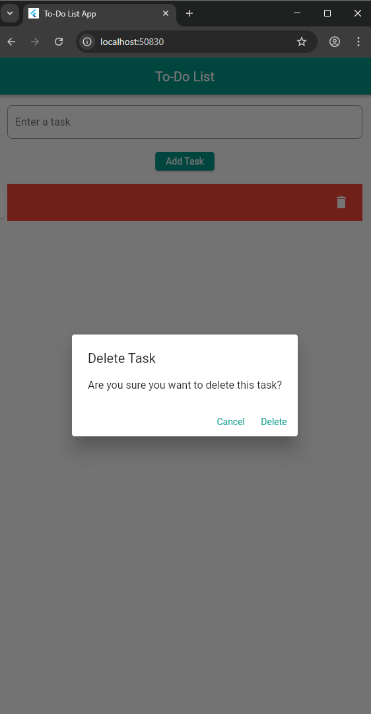

# 📝 Flutter Todo App

A beginner-friendly Flutter Todo App that allows users to add, complete, and delete tasks during the session.

---

## 📸 Screenshots

 |  | 

---

## 🚀 Features

- ✅ Add new tasks
- 🗑️ Delete existing tasks
- ✔️ Mark tasks as completed
- 📱 Clean and responsive user interface

> ⚠️ Note: Tasks are **not stored permanently**. They disappear when the app is restarted. (No database or local storage used). I plan to add that in the nearest future.

---

## 🛠️ Built With

- [Flutter](https://flutter.dev/)
- [Dart](https://dart.dev/)

---

## 📦 Getting Started

### Prerequisites

- Flutter SDK installed → [Install Flutter](https://flutter.dev/docs/get-started/install)
- VS Code with Flutter & Dart plugins
- A device/emulator to run the app.

### Installation

1. **Clone the repository:**

   ```bash
   git clone https://github.com/petersoluki/PRODIGY_AD_01.git
   cd PRODIGY_AD_02
   ```

2. **Run the app:**

   ```bash
   flutter run
   ```

---

---

## 📁 Project Structure

```
lib/
├── pages/
    ├── todohomepage.dart       # Contains UI and todo logic
├── main.dart                   # Entry point
├── task.dart                   # The Task class
```

---

## ✨ How It Works

- Tasks are managed using a simple `List<Map>` in memory
- The UI updates using `setState()` whenever the task list changes
- No persistent storage (tasks clear on app restart)

---

## 🙌 Contributing

Contributions are welcome!  
Open an issue or submit a pull request with suggestions or bug fixes.

---

## 👨‍💻 Author

- **Peter Eze**
  📧 [petersoluki@gmail.com]  
  🔗 [LinkedIn](https://www.linkedin.com/https://www.linkedin.com/in/peter-eze-036a0b25a/) | [GitHub](https://github.com/petersoluki)

---

## 📃 License

This project is licensed under the [MIT License](LICENSE).
